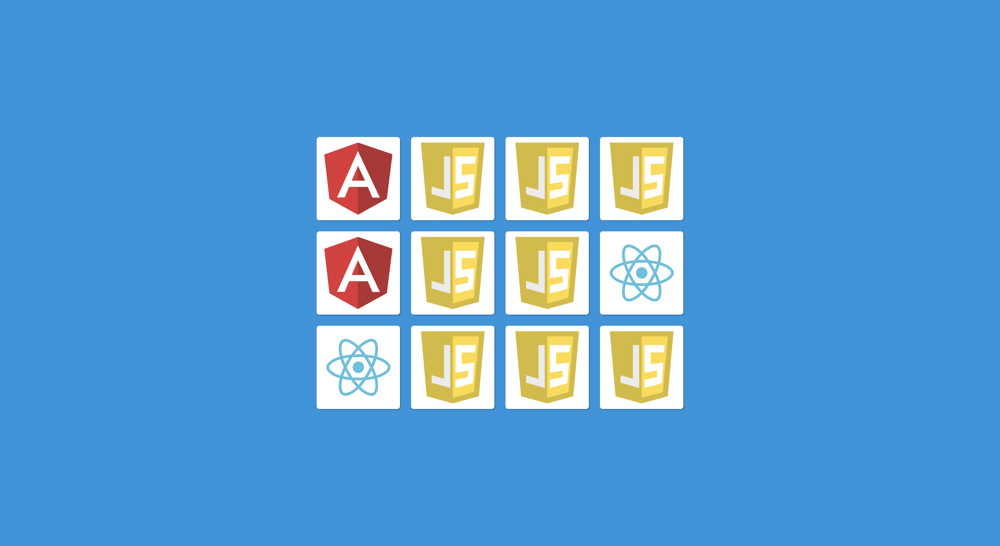

# Memory Game

> A classic memory game created with React and TypeScript.

## Preview

## Available Scripts

In the project directory, you can run:

### `npm start`

Runs the app in the development mode. 
Open [http://localhost:3000](http://localhost:3000) to view it in the browser.

### `npm test`

Launches the test runner in the interactive watch mode. 

### `npm run build`

Builds the app for production to the `build` folder.
